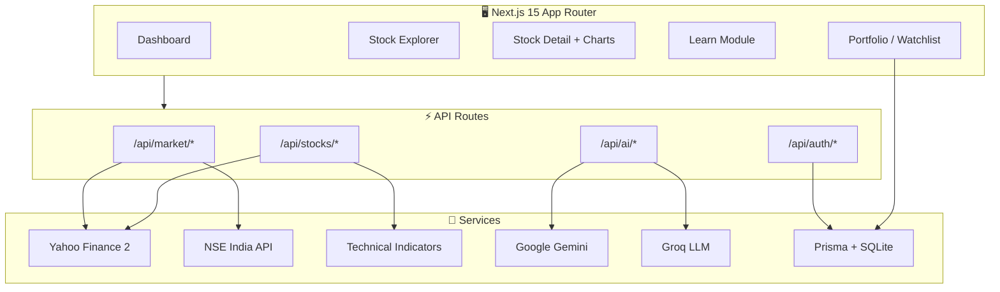

<div align="center">

# 📈 StockSense AI

### *Your AI-powered co-pilot for the Indian stock market*

**Track NSE & BSE · Analyze with AI · Learn from scratch · Build your portfolio**

<br />

[](https://nextjs.org/)
[](https://react.dev/)
[](https://www.typescriptlang.org/)
[](https://tailwindcss.com/)
[](https://www.prisma.io/)
[](https://ai.google.dev/)

<br />

[🚀 Quick Start](#-quick-start) · [✨ Features](#-features) · [🏗️ Architecture](#️-architecture) · [🔌 API](#-api-reference) · [📁 Structure](#-project-structure)

<br />

```
   ╔══════════════════════════════════════════════════════════╗
   ║  NIFTY  ·  SENSEX  ·  RSI  ·  MACD  ·  AI INSIGHTS     ║
   ║                                                          ║
   ║     "Stocks samjho, smart invest karo."                  ║
   ╚══════════════════════════════════════════════════════════╝
```

</div>

---

## 🌟 What is StockSense AI?

**StockSense AI** is a full-stack, beginner-friendly platform built for Indian retail investors. It combines **live market data** (NSE, BSE via Yahoo Finance), **professional-grade technical analysis**, and **conversational AI** (Google Gemini + Groq) — all wrapped in a sleek dark-mode dashboard.

Whether you're checking NIFTY before breakfast or learning what a P/E ratio means, StockSense has you covered.

> ⚠️ **Disclaimer:** StockSense AI is for **educational purposes only**. It is **not** SEBI-registered investment advice. Always do your own research before investing.

---

## ✨ Features

<table>
<tr>
<td width="50%">

### 📊 Live Market Dashboard
- Real-time **NIFTY, SENSEX & sector indices**
- **Top gainers & losers** from NSE
- **Sector heatmap** — see which industries are hot
- **Market mood score** — bullish or bearish at a glance
- Live **market open/closed** indicator (IST 9:15–15:30)

</td>
<td width="50%">

### 🤖 AI-Powered Analysis
- **One-click stock analysis** with BUY / HOLD / SELL signals
- **Confidence scores** & structured action plans
- **Per-stock AI chatbot** — ask anything in plain English
- **Daily AI tip** — fresh market wisdom every day
- Gemini primary · Groq fallback · mock mode without keys

</td>
</tr>
<tr>
<td width="50%">

### 📉 Technical Analysis Engine
- Interactive **candlestick charts** (1W → 1Y)
- **RSI, MACD, Bollinger Bands, EMA/SMA, ADX**
- **Candlestick pattern detection**
- Support & resistance levels
- Volume analysis signals

</td>
<td width="50%">

### 💼 Portfolio & Watchlist
- Track holdings with **live P&L**
- Add stocks with buy price, quantity & date
- **Persistent watchlist** (synced when signed in)
- Quick-add from any stock detail page
- Sparkline mini-charts everywhere

</td>
</tr>
<tr>
<td width="50%">

### 🎓 Learn & Grow
- **15 structured lessons** across 3 modules
- Stock basics → Technical analysis → Smart investing
- **Progress tracking** per lesson
- Built-in **financial glossary**
- Curated **courses, YouTube channels & books**

</td>
<td width="50%">

### 🔐 Auth & Data
- **GitHub OAuth** sign-in (optional)
- SQLite + **Prisma ORM** for user data
- Server-side caching for fast API responses
- Responsive design — desktop & mobile nav

</td>
</tr>
</table>

---

## 🏗️ Architecture



---

## 🛠️ Tech Stack

| Layer | Technologies |
|-------|-------------|
| **Framework** | [Next.js 15](https://nextjs.org/) (App Router), [React 19](https://react.dev/) |
| **Language** | [TypeScript 6](https://www.typescriptlang.org/) |
| **Styling** | [Tailwind CSS 4](https://tailwindcss.com/), [Radix UI](https://www.radix-ui.com/), [Framer Motion](https://www.framer.com/motion/) |
| **Charts** | [Lightweight Charts](https://tradingview.github.io/lightweight-charts/) |
| **Data** | [Yahoo Finance 2](https://github.com/gadicc/yahoo-finance2), NSE India API |
| **Technical Analysis** | [technicalindicators](https://www.npmjs.com/package/technicalindicators) |
| **AI** | [Google Gemini 2.0 Flash](https://ai.google.dev/), [Groq Llama 3.3 70B](https://groq.com/) |
| **Auth** | [NextAuth v5](https://authjs.dev/) + GitHub OAuth |
| **Database** | [Prisma](https://www.prisma.io/) + SQLite |
| **State** | [Zustand](https://zustand.docs.pmnd.rs/), [TanStack Query](https://tanstack.com/query) |

---

## 🚀 Quick Start

### Prerequisites

- **Node.js 18+** (20+ recommended)
- **npm** or **pnpm**
- Free API keys from [Google AI Studio](https://ai.google.dev/) and/or [Groq Console](https://console.groq.com/)

### 1 · Clone & Install

```bash
git clone https://github.com/your-username/stocksense-ai.git
cd stocksense-ai
npm install
```

### 2 · Configure Environment

```bash
cp .env.example .env
```

Edit `.env` with your keys:

| Variable | Required | Description |
|----------|----------|-------------|
| `GEMINI_API_KEY` | Recommended | Google Gemini — primary AI provider |
| `GROQ_API_KEY` | Recommended | Groq — fallback AI provider |
| `AUTH_SECRET` | Yes | Random secret — run `openssl rand -base64 32` |
| `NEXTAUTH_SECRET` | Yes | Same as above (or another random string) |
| `NEXTAUTH_URL` | Yes | `http://localhost:3000` for local dev |
| `GITHUB_ID` | Optional | GitHub OAuth client ID |
| `GITHUB_SECRET` | Optional | GitHub OAuth client secret |
| `DATABASE_URL` | Yes | Default: `file:./dev.db` |

<details>
<summary><b>🔑 How to get API keys (click to expand)</b></summary>

<br />

**Google Gemini (free tier)**
1. Go to [ai.google.dev](https://ai.google.dev/)
2. Click **Get API Key** → create a project → copy the key
3. Paste into `GEMINI_API_KEY`

**Groq (free tier)**
1. Sign up at [console.groq.com](https://console.groq.com/)
2. Navigate to **API Keys** → create a new key
3. Paste into `GROQ_API_KEY`

**GitHub OAuth (optional)**
1. Go to [GitHub Developer Settings](https://github.com/settings/developers)
2. **New OAuth App** → Homepage: `http://localhost:3000`, Callback: `http://localhost:3000/api/auth/callback/github`
3. Copy Client ID & Secret into `.env`

</details>

### 3 · Set Up Database

```bash
npm run db:push
```

### 4 · Run Development Server

```bash
npm run dev
```

Open **[http://localhost:3000](http://localhost:3000)** — you're in! 🎉

<details>
<summary><b>📦 All available scripts</b></summary>

<br />

| Command | Description |
|---------|-------------|
| `npm run dev` | Start development server |
| `npm run build` | Production build |
| `npm run start` | Start production server |
| `npm run lint` | Run ESLint |
| `npm run db:generate` | Generate Prisma client |
| `npm run db:push` | Push schema to SQLite |
| `npm run db:studio` | Open Prisma Studio GUI |

</details>

---

## 🗺️ App Pages

| Route | What you'll find |
|-------|-----------------|
| `/` | **Dashboard** — indices, gainers/losers, heatmap, daily AI tip |
| `/stocks` | **Explore** — browse & search NSE top stocks |
| `/stocks/[symbol]` | **Stock detail** — charts, technicals, AI analysis, chatbot |
| `/watchlist` | **Watchlist** — your tracked stocks |
| `/portfolio` | **Portfolio** — holdings with live P&L |
| `/learn` | **Learn** — 15 lessons, glossary, progress |
| `/resources` | **Resources** — courses, YouTube, books, tools |
| `/login` | **Sign in** — GitHub OAuth |

---

## 🔌 API Reference

<details>
<summary><b>📡 Market Endpoints</b></summary>

<br />

| Method | Endpoint | Description |
|--------|----------|-------------|
| `GET` | `/api/market/indices` | NIFTY, SENSEX & major indices |
| `GET` | `/api/market/gainers` | Top NSE gainers |
| `GET` | `/api/market/losers` | Top NSE losers |
| `GET` | `/api/market/trending` | Trending stocks |
| `GET` | `/api/market/heatmap` | Sector-wise performance |

</details>

<details>
<summary><b>📈 Stock Endpoints</b></summary>

<br />

| Method | Endpoint | Description |
|--------|----------|-------------|
| `GET` | `/api/stocks?symbols=A,B` | Batch stock quotes |
| `GET` | `/api/stocks/[symbol]` | Full stock info |
| `GET` | `/api/stocks/[symbol]/chart?period=1y&interval=1d` | OHLCV candle data |
| `GET` | `/api/stocks/[symbol]/technical` | RSI, MACD, BB, EMA, patterns |
| `POST` | `/api/stocks/[symbol]/analyze` | AI-powered stock analysis |

</details>

<details>
<summary><b>🤖 AI Endpoints</b></summary>

<br />

| Method | Endpoint | Description |
|--------|----------|-------------|
| `GET` | `/api/ai/daily-tip` | Today's AI market tip |
| `POST` | `/api/ai/chat` | Conversational stock Q&A |

</details>

---

## 📁 Project Structure

```
StockSense AI/
├── app/
│   ├── (auth)/              # Login & register pages
│   ├── (dashboard)/         # Main app — dashboard, stocks, learn, etc.
│   └── api/                 # REST API routes
│       ├── ai/              # Daily tip + chat
│       ├── auth/            # NextAuth handlers
│       ├── market/          # Indices, gainers, heatmap
│       └── stocks/          # Quotes, charts, technicals, analyze
├── components/
│   ├── analysis/            # AI panel, chatbot, indicators
│   ├── charts/              # Candlestick, sparkline, volume
│   ├── dashboard/           # Dashboard widgets
│   ├── learn/               # Lessons & glossary
│   ├── layout/              # Sidebar, topbar, mobile nav
│   └── ui/                  # Reusable UI primitives
├── lib/
│   ├── data/                # Lessons, glossary, NSE stocks, resources
│   ├── stores/              # Zustand — portfolio & watchlist
│   ├── gemini.ts            # Gemini AI integration
│   ├── groq.ts              # Groq AI integration
│   ├── indicators.ts        # Technical analysis engine
│   ├── stock-data.ts        # Yahoo Finance wrapper
│   └── nse-api.ts           # NSE India data fetcher
├── prisma/
│   └── schema.prisma        # User, Watchlist, Portfolio, Progress
└── auth.ts                  # NextAuth configuration
```

---

## 🎓 Learning Modules

StockSense includes **15 bite-sized lessons** designed for complete beginners:

<details>
<summary><b>📘 Module 1 — Stock Market Basics (5 lessons)</b></summary>

- What is a Stock?
- NSE vs BSE — What's the Difference?
- How Stock Prices Move
- Types of Orders: Market, Limit, Stop-Loss
- Reading a Stock Quote

</details>

<details>
<summary><b>📗 Module 2 — Technical Analysis (5 lessons)</b></summary>

- Introduction to Candlestick Charts
- Support & Resistance
- Moving Averages (SMA & EMA)
- RSI & MACD Explained
- Volume — The Hidden Signal

</details>

<details>
<summary><b>📙 Module 3 — Smart Investing (5 lessons)</b></summary>

- Building Your First Portfolio
- Risk Management & Position Sizing
- Fundamental Analysis Basics (P/E, EPS)
- Long-Term vs Short-Term
- Common Beginner Mistakes to Avoid

</details>

---

## 🎨 Design System

StockSense uses a **dark-first** financial terminal aesthetic:

| Token | Color | Usage |
|-------|-------|-------|
| `brand` | `#00C896` | Primary accent, CTAs |
| `ai-accent` | `#6366F1` | AI features, gradients |
| `stock-up` | `#22C55E` | Gains, bullish signals |
| `stock-down` | `#EF4444` | Losses, bearish signals |
| `background` | `#0A0F1A` | Page background |
| `surface` | `#111827` | Cards & panels |

**Fonts:** [Inter](https://fonts.google.com/specimen/Inter) (body) · [Space Grotesk](https://fonts.google.com/specimen/Space+Grotesk) (headings)

---

## 🧠 How AI Analysis Works

```
Stock Data (Yahoo)  +  Technical Indicators (RSI, MACD, BB…)
                    │
                    ▼
            ┌───────────────┐
            │  Gemini 2.0   │  ← Primary
            │     Flash     │
            └───────┬───────┘
                    │ fallback
            ┌───────▼───────┐
            │ Groq Llama    │
            │  3.3 70B      │
            └───────┬───────┘
                    │
                    ▼
     Structured Markdown Report
     (Recommendation · Confidence · Action Plan · Risks)
```

The AI is prompted as **StockSense** — a patient Indian market teacher who explains everything in simple language with Hindi/English analogies, and always includes a SEBI disclaimer.

---

## 🤝 Contributing

Contributions are welcome! Here's how to get started:

1. **Fork** the repository
2. **Create** a feature branch: `git checkout -b feature/amazing-feature`
3. **Commit** your changes: `git commit -m 'Add amazing feature'`
4. **Push** to the branch: `git push origin feature/amazing-feature`
5. **Open** a Pull Request

---

## 📄 License

This project is open source. Feel free to use, modify, and distribute with attribution.

---

<div align="center">

<br />

**Built with 💚 for Indian retail investors**

*Stocks samjho. Smart invest karo. Stay curious.*

<br />

⭐ **Star this repo** if StockSense helped you learn something new!

<br />

```
⚠️  Not financial advice. Past performance ≠ future results. Invest responsibly.
```

</div>
